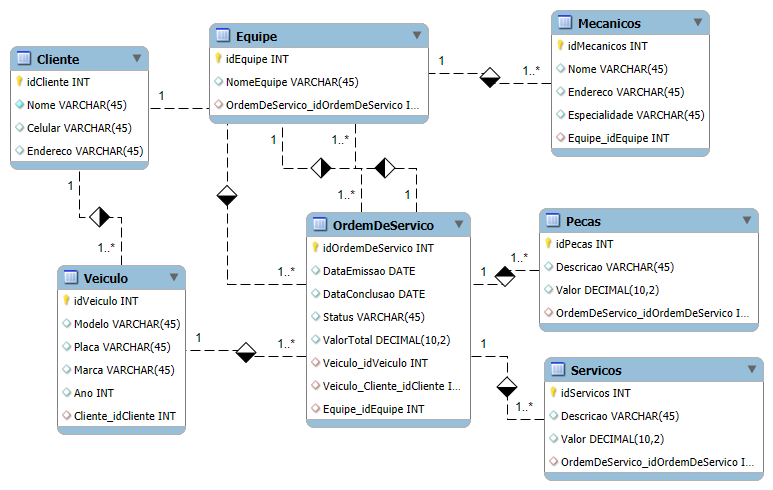

# DIO_SQLtest4
Modelo de banco de dados relacional para oficina mecânica, incluindo diagrama ER, script de criação de tabelas, inserção de dados fictícios e consultas SQL para testes, análises e simulações de operações reais em ambiente MySQL.

# 🛠️ Projeto Banco de Dados - Oficina Mecânica

Este projeto tem como objetivo a modelagem e implementação de um banco de dados relacional para o gerenciamento de uma oficina mecânica. A estrutura foi desenvolvida a partir de um modelo entidade-relacionamento (ER) e posteriormente transformada em um modelo lógico com script SQL para criação e manipulação de dados.

---

## 📌 Objetivos

- Modelar um banco de dados para uma oficina mecânica com base no modelo ER.
- Criar o script SQL para gerar o banco de dados e popular com dados fictícios.
- Elaborar queries SQL com diferentes cláusulas para análise e recuperação dos dados.

---

## 🧱 Estrutura do Banco de Dados

O banco de dados contém as seguintes entidades:

- **Cliente**: armazena dados dos clientes da oficina.
- **Veiculo**: contém informações sobre os veículos dos clientes.
- **OrdemDeServico**: registra ordens de serviço realizadas.
- **Equipe**: equipes responsáveis por cada ordem.
- **Mecanicos**: funcionários vinculados a uma equipe.
- **Peças**: peças utilizadas em cada ordem.
- **Serviços**: serviços prestados em cada ordem.

---

## 📊 Diagrama do Banco de Dados

Abaixo está o diagrama entidade-relacionamento utilizado para guiar a modelagem:



---

## 🧾 Scripts Incluídos

### Criação de Tabelas
Inclui todos os comandos `CREATE TABLE` com chaves primárias e estrangeiras representando os relacionamentos do modelo.

### Inserção de Dados
Contém `INSERT INTO` com dados fictícios para simulação e testes.

### Consultas SQL

- `SELECT` simples para recuperar colunas específicas.
- Filtros com `WHERE` e expressões com `LIKE` e operadores.
- Atributos derivados com expressões aritméticas.
- Ordenações com `ORDER BY`.
- Agrupamentos e filtros com `GROUP BY` e `HAVING`.
- `JOINs` entre múltiplas tabelas.

---

## 🧪 Exemplos de Queries

```sql
-- Clientes com nome iniciando com Maria
SELECT * FROM Cliente WHERE Nome LIKE 'Maria%';

-- Valor com 10% de desconto nas ordens
SELECT idOrdemDeServico, ValorTotal, ValorTotal * 0.9 AS ValorComDesconto FROM OrdemDeServico;

-- Veículos de clientes com mais de 1 carro
SELECT Cliente_idCliente, COUNT(*) AS QtdeVeiculos
FROM Veiculo
GROUP BY Cliente_idCliente
HAVING COUNT(*) > 1;

-- Ordem de serviço com nome do cliente
SELECT o.idOrdemDeServico, c.Nome AS Cliente, o.Status
FROM OrdemDeServico o
JOIN Cliente c ON o.Veiculo_Cliente_idCliente = c.idCliente;
